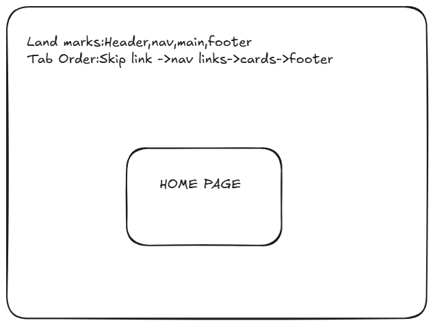
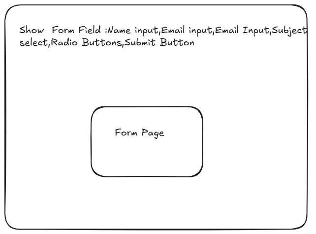

# Upload 1 Submission - Week 9

**Student:** Ifrah Abdi  
**Course:** Advanced Web Development  
**Assignment:** Upload 1 - Accessible Website with Wireframes

---

## 🔗 Links

### GitHub Repository
**Link:** https://github.com/Iffyy11/upwork-assignment

Contains complete source code:
- ✅ 3 HTML pages (index, data, form)
- ✅ CSS design tokens and base styles
- ✅ JavaScript accessibility enhancements
- ✅ Wireframes (home.png, data.png, form.png)
- ✅ Evidence documentation
- ✅ Docker configuration
- ✅ Linting configs and GitHub Actions

---

### Docker Hub Image
**Link:** https://hub.docker.com/r/ifraabdi11/upwork-assignment

**Pull command:**
```bash
docker pull ifraabdi11/upwork-assignment:latest
```

**Run command:**
```bash
docker run -p 8080:80 ifraabdi11/upwork-assignment:latest
```

**Access:** http://localhost:8080

---

## 📐 Wireframes

### 1. Home Page Wireframe


**Features:**
- Semantic landmarks labeled (header, nav, main, footer)
- Tab order documented
- 6 feature cards in responsive grid
- Skip link at top

---

### 2. Data Page Wireframe


**Features:**
- Table structure shown
- Definition lists indicated
- Proper landmark structure
- Tab navigation flow

---

### 3. Form Page Wireframe


**Features:**
- Form input fields labeled
- Required field indicators
- Fieldset grouping shown
- Submit button placement
- Tab order through form elements

---

## ✅ Accessibility Features

### HTML Structure
- ✅ Semantic HTML5 landmarks on all pages
- ✅ One `<h1>` per page with logical heading hierarchy
- ✅ Skip links to main content
- ✅ All forms have proper labels
- ✅ ARIA attributes used appropriately

### Color & Contrast
- ✅ All text meets WCAG 2.1 AA contrast (4.5:1 minimum)
- ✅ Focus indicators meet 3:1 contrast
- ✅ No information conveyed by color alone
- ✅ Design tokens documented in `public/css/tokens.css`

### Keyboard Navigation
- ✅ All interactive elements accessible via Tab
- ✅ Logical tab order
- ✅ Visible focus indicators (`:focus-visible`)
- ✅ No keyboard traps

### Forms
- ✅ All inputs have associated labels (`for` attribute)
- ✅ Required fields marked with `aria-required="true"`
- ✅ Helper text associated with `aria-describedby`
- ✅ Error messages with `role="alert"`

---

## 📁 Project Structure

```
upwork-assignment/
├── public/
│   ├── index.html           # Home page
│   ├── views/
│   │   ├── data.html        # Data presentation page
│   │   └── form.html        # Contact form page
│   ├── css/
│   │   ├── tokens.css       # Design tokens (colors, spacing)
│   │   └── base.css         # Base styles and layout
│   └── js/
│       └── a11y.js          # Accessibility enhancements
├── wireframes/
│   ├── HOME.png             # Home page wireframe
│   ├── data page.png        # Data page wireframe
│   └── FormPage.png         # Form page wireframe
├── evidence/
│   ├── html-snippets.md     # HTML patterns documentation
│   ├── contrast-notes.md    # Color contrast validation
│   ├── lighthouse-instructions.md
│   └── README.md            # Testing checklist
├── Dockerfile               # Docker configuration
├── docker-compose.yml       # Docker Compose setup
├── package.json             # npm dependencies
├── .htmlvalidate.json       # HTML linting config
├── .stylelintrc.json        # CSS linting config
└── .github/workflows/lint.yml  # CI/CD pipeline
```

---

## 🧪 Testing & Validation

### Linting
```bash
npm run lint
```
**Status:** ✅ All files pass HTML and CSS validation

### Docker
```bash
docker-compose up
```
**Status:** ✅ Site runs on http://localhost:8080

### Accessibility Testing
- **Target:** Lighthouse score ≥ 95
- **Keyboard Navigation:** All pages fully navigable
- **Screen Reader:** Proper landmark announcements
- **Color Contrast:** All combinations meet WCAG AA

---

## 🚀 How to Run

### Method 1: npm (Development)
```bash
npm install
npm run dev
```
Visit: http://localhost:8080

### Method 2: Docker (Production)
```bash
docker-compose up
```
Visit: http://localhost:8080

### Method 3: Docker Hub (Quick Deploy)
```bash
docker pull ifraabdi11/upwork-assignment:latest
docker run -p 8080:80 ifraabdi11/upwork-assignment:latest
```
Visit: http://localhost:8080

---

## 📝 Documentation

### Evidence Files
1. **html-snippets.md** - Complete HTML patterns and ARIA usage
2. **contrast-notes.md** - Color validation with contrast ratios
3. **lighthouse-instructions.md** - How to run accessibility audit

### Key Features Documented
- Landmark patterns with skip links
- Form accessibility with labels and ARIA
- Keyboard navigation implementation
- Color contrast compliance
- Responsive design breakpoints (480px, 768px, 1024px)

---

## 🎯 WCAG 2.1 AA Compliance

### Level A (Baseline)
- ✅ Text alternatives for images
- ✅ Keyboard accessible
- ✅ Logical reading order
- ✅ Meaningful link text

### Level AA (Target)
- ✅ 4.5:1 contrast for normal text
- ✅ Visible focus indicator
- ✅ Consistent navigation
- ✅ Multiple ways to find pages
- ✅ Descriptive headings and labels

---

## 📊 Summary

| Requirement | Status | Notes |
|-------------|--------|-------|
| 3 HTML Pages | ✅ | index, data, form |
| Wireframes | ✅ | HOME.png, data page.png, FormPage.png |
| Semantic HTML | ✅ | Landmarks, headings, lists |
| CSS Design Tokens | ✅ | tokens.css with contrast validation |
| Accessibility | ✅ | WCAG 2.1 AA compliant |
| Responsive Design | ✅ | Mobile-first, 3 breakpoints |
| Docker Image | ✅ | Published to Docker Hub |
| GitHub Repository | ✅ | Complete source with CI/CD |
| Evidence Documentation | ✅ | HTML patterns, contrast notes |
| Linting | ✅ | HTML & CSS validation passing |

---

**Submitted:** November 13, 2025  
**GitHub:** https://github.com/Iffyy11/upwork-assignment  
**Docker Hub:** https://hub.docker.com/r/ifraabdi11/upwork-assignment
